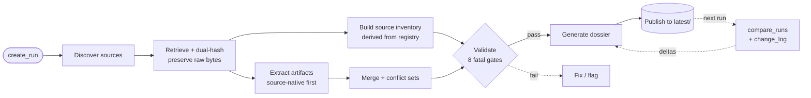

# Company Due Diligence

A reusable, **refreshable, versioned research-corpus system** for company due diligence and
market intelligence, packaged as a Claude Code skill.

> **Not a one-shot report generator.** It builds an evidence corpus: it discovers and
> *preserves* original sources, extracts artifacts with full provenance lineage, validates
> them against evidentiary gates, and renders a dossier — then on every re-run detects,
> classifies, and logs what changed. Every run is immutable and reproducible.

---

## When to use

Use this skill when you need to:

- **Research / profile a company** in depth from primary sources (filings, IR, registries, patents, products, pricing).
- **Build a due-diligence dossier** with citations you can trust and audit.
- **Refresh** an existing profile and **see exactly what changed** since the last run.
- Extract a company's **corporate structure, financials, products, competitors, risks, or recent developments** with traceable evidence.
- Screen for **sanctions exposure** (OFAC SDN/Consolidated, EU, UK OFSI, UN, BIS Entity List), **sanctioned-country / region operations** (Russia, Belarus, Iran, North Korea, Syria, Cuba, Crimea/DNR/LNR), **Russia/Belarus exit status**, export-control exposure, and PEP / adverse-media signals.

It activates on phrases like *"due diligence"*, *"company profile/dossier"*, *"market
intelligence"*, `research <company>`, or refresh/compare requests (see
[`SKILL.md`](SKILL.md) for the full activation contract).

**Not for:** quick one-paragraph company blurbs, real-time price quotes, or anything that
doesn't warrant preserved, cited evidence. For those, answer directly.

---

## How it works

The methodology is **discover → preserve → extract → structure → validate → dossier**. The
Claude agent performs discovery, retrieval, and reasoning (guided by `prompts/`); deterministic
Python (`cdd/`) does all bookkeeping and **never touches the network**.



Evidence flows one way and is never overwritten: raw bytes land in `raw_sources/`, structured
artifacts (with lineage) in `structured/`, and append-only event logs record every source and
artifact across all runs. `latest/` is published only after validation passes.

---

## What's inside

| Area | Location | What it provides |
|------|----------|------------------|
| **Engine** (deterministic, network-free) | `cdd/` | identity & run lifecycle, dual-hash canonicalization + `diff_class`, append-only event-log registries, derived manifest & source inventory, run comparison + delta classification, evidentiary validation, lineage-preserving merge + conflict sets, validation-gated atomic publish, exporters |
| **Schemas** (9) | `schemas/` | `run_manifest`, `source_registry`, `artifact_registry`, `source_inventory`, `extracted_artifact`, `financial_artifact`, `product_artifact`, `company_dossier`, `data_quality_report` (+ `conflict_set`) |
| **Prompts** (14) | `prompts/` | orchestrator · discovery · retrieval · extraction prompts (evidence, product, financial, corporate-structure, market-intel, risk, event, **sanctions-screening**) · validation · dossier · run comparison |
| **References** (9) | `references/` | research methodology · source priority · data quality · anti-hallucination · **sanctions screening rules** · financial & product extraction rules · legal/ToS · provenance & reproducibility |
| **CLIs** (15) | `scripts/` | run lifecycle, hashing, registry updates, inventory/manifest builders, compare/change-log, validation, merge, exporters, install |
| **Optional extraction tools** | `cdd/extract/` | HTML cleaning, PDF tables, EDGAR, SSRF-guarded HTTP fetch, **OFAC-SDN sanctions helper** (`cdd.extract.sanctions`) — lazy-loaded; absence degrades gracefully |

The `scripts/` CLIs are thin, deterministic wrappers over the `cdd/` engine — `SKILL.md` and
the prompts drive the agent through `scripts/`, while `cdd/` holds the testable logic.

Entry point for the agent: [`SKILL.md`](SKILL.md). Deep guidance lives in `prompts/` and
`references/` (progressive disclosure — `SKILL.md` stays short and links out).

---

## Design principles

1. **Discover first, preserve always.** Original bytes, source-native tables, native product
   taxonomies, and native financial line items are preserved *before* any normalization.
2. **Schema emerges from sources.** Normalization is a separate, derived, non-destructive layer
   (`normalized_candidate` fields); the company's real structure is never flattened away.
3. **Full provenance.** Every structured value and every dossier claim resolves to a source
   snapshot + cell/quote-level locator + snippet + the extraction prompt version.
4. **Versioned & immutable.** Runs are never overwritten; only `latest/`, registries, indexes,
   and manifests update. History is reconstructable from the event logs.
5. **Anti-hallucination.** Facts, extracted evidence, and analysis are separated; every claim is
   cited or tagged `[INFERENCE]`; missing data is `null`/`unknown`; conflicting sources are
   preserved as `conflict_set`s, never silently resolved.
6. **Deterministic bookkeeping, agent retrieval.** Scripts are pure and offline; the agent does
   retrieval; optional `cdd/extract/` tools add reliability for PDFs/EDGAR/HTML.
7. **Reproducible & drift-aware.** `run_manifest` pins prompt-set, schema-set, model, and tool
   versions so `compare_runs` can separate *source* change from *extraction* and *schema* change.

---

## Install & activate

Requirements: Python ≥ 3.12 and [`uv`](https://docs.astral.sh/uv/).

```bash
cd company-due-diligence

# Core engine + dev tooling (scripts, schemas, validation, tests)
uv venv && uv pip install -e ".[dev]"

# Optional: extraction stack (PDF, HTML, EDGAR, hardened fetch)
uv pip install -e ".[extract]"
```

Activate as a Claude Code skill (idempotent symlink into your skills directory; never deletes a
real directory):

```bash
python scripts/install_skill.py --skills-dir ~/.claude/skills
```

---

## Using the skill

This is a Claude Code **skill** — there is no command to "run." Once installed (above), it
**auto-activates** from its `SKILL.md` description: you **just ask Claude Code in natural
language**, and Claude drives the whole pipeline for you, writing everything under
`output/companies/{slug}/`.

**Ask Claude Code** something like:

> Do **full due diligence** on **Acme Analytics** (acme.com, NASDAQ: ACME) — corporate
> structure, financials, products, competitors, risks, and **sanctions / Russia exposure**.

> **Refresh** the Acme Analytics dossier and tell me **what changed** since the last run.

> **Screen Stripe** against OFAC / EU / UK sanctions lists and check **sanctioned-country exposure**.

> Build a due-diligence **dossier** for OpenAI focused on **funding and M&A**.

The skill fires on phrases like *due diligence*, *company profile / dossier*, *market
intelligence*, *research &lt;company&gt;*, or refresh/compare requests. You can name a **run
mode** (*full refresh*, *incremental*, *compare runs*, *validation only*, *dossier only*, …) and
pass optional context (website, ticker, country, legal name, subsidiaries, research focus).

Claude then: creates a run → discovers & preserves sources → extracts artifacts → **screens
sanctions** → validates (8 gates) → renders a **cited dossier**, publishing to `latest/` only
after validation passes. Read the result at
`output/companies/{slug}/runs/{run_id}/final_dossier.md` (machine-readable `.json` alongside).

> **Tip:** want strictly primary-source, audit-grade output? Say so — the skill never invents
> data, cites every claim or marks it `[INFERENCE]`, and reports "no sanctions match on
> [lists] as of [date]" rather than declaring a company "clean."

### Under the hood / manual control (advanced)

Claude runs the deterministic spine for you. You can also drive it directly — for scripting, CI,
or step-by-step control. End-to-end:

| Step | Command / prompt |
|------|------------------|
| 1. Create run | `scripts/create_run.py` |
| 2. Discover sources | `prompts/source_discovery.md` → `scripts/update_source_registry.py` |
| 3. Retrieve & hash | agent retrieval → `scripts/compute_hashes.py` |
| 4. Extract & register | `prompts/*_extraction.md` + `prompts/sanctions_screening.md` → `scripts/update_artifact_registry.py` |
| 5. Build source inventory | `scripts/build_source_inventory.py` *(derived from the registry; required by validation & compare)* |
| 6. Validate | `scripts/validate_outputs.py` (8 fatal gates) |
| 7. Compare (re-runs) | `scripts/compare_runs.py` + `scripts/generate_change_log.py` |
| 8. Dossier & publish | `prompts/dossier_generation.md` → `final_dossier.{md,json}` → `latest/` |

```bash
# 1. Create a run (prints run_id + company_slug)
python scripts/create_run.py --company "Acme Analytics" --mode full_refresh
# → run_id: 20260621T120000Z-f3e2d1   company_slug: acme-analytics
#   create_run takes --company, --mode, --root, --token; website/ticker/etc. are
#   research context for the agent, not CLI flags.

# 5. Materialize the per-run source inventory from the registry
python scripts/build_source_inventory.py \
  --company-id acme-analytics --run-id 20260621T120000Z-f3e2d1 --now 2026-06-21T12:00:00Z

# 6. Validate (exit code 1 on any fatal-gate failure)
python scripts/validate_outputs.py \
  --company-id acme-analytics --run-id 20260621T120000Z-f3e2d1 \
  --mode full_refresh --now 2026-06-21T12:00:00Z
```

---

## Run modes

| Mode | Description |
|------|-------------|
| `full_refresh` | Rediscover and re-retrieve all sources; full extraction pipeline |
| `incremental_refresh` | Retrieve only changed/new sources (hash-gated); update affected artifacts |
| `source_discovery_only` | Discover and register sources; no retrieval or extraction |
| `source_retrieval_only` | Retrieve and hash registered sources; no extraction |
| `extraction_only` | (Re-)extract from already-retrieved raw sources |
| `validation_only` | Run all 8 fatal gates against an existing run directory |
| `dossier_only` | Regenerate dossier from current validated artifacts; no upstream steps |
| `compare_runs` | Diff two run directories; emit change log |

---

## Output structure

```
output/companies/{slug}/
├── runs/{run_id}/
│   ├── raw_sources/              # verbatim downloaded files (HTML, PDF, JSON)
│   ├── raw_artifacts/            # raw extraction outputs before structuring
│   ├── extracted_tables/         # source-native tables preserved verbatim
│   ├── structured/               # schema-validated artifacts (one JSON each),
│   │   ├── *.json                #   plus source_inventory.json (derived) and
│   │   └── _merged.json          #   _merged.json (merge output; skipped as non-artifact)
│   ├── reports/                  # reserved for agent-authored intermediate reports
│   ├── logs/
│   ├── run_manifest.json         # this run's manifest (incl. reproducibility block)
│   ├── final_dossier.md          # rendered dossier (run-dir root, not reports/)
│   ├── final_dossier.json        # machine-readable dossier (validates company_dossier)
│   ├── change_log.md             # cross-run diff (compare_runs → generate_change_log)
│   ├── data_quality_report.md    # validate_outputs gate results (human-readable)
│   └── data_quality_report.json  # validate_outputs report (machine-readable)
├── source_registry.jsonl         # append-only source event log (all runs)
├── artifact_registry.jsonl       # append-only artifact event log (all runs)
├── manifest.json                 # derived company-level current-state index
├── latest/                       # flat COPIES of the last validated run's published
│                                 #   files (final_dossier.*, data_quality_report.*,
│                                 #   change_log.md, source_inventory.json, run_manifest.json)
└── history/{run_id}.json         # one published-run record per run
```

---

## Data quality & validation gates

Eight **fatal** gates run via `scripts/validate_outputs.py`. A run that fails any gate must not
be published to `latest/` or used to generate a dossier.

| Gate | Description |
|------|-------------|
| `schemas_valid` | Every structured artifact validates against its registered JSON Schema (degraded/no-`jsonschema` validation fails in strict modes) |
| `referential_integrity` | All `source_id` / `artifact_id` / citation cross-references resolve within the run |
| `lineage_complete` | All five lineage fields (source_snapshot_id, content_path, snippet, locator, extraction_prompt) present; every `fact`/`evidence` claim cited |
| `id_integrity` | `artifact_id` values are unique across the run |
| `financial_usability` | Every financial line item has scope, cell_locator, a valid period ref with currency + unit_scale; no duplicate tuples |
| `manifest_closure` | Every path declared in `run_manifest.output_paths` exists on disk |
| `refresh_semantics` | (incremental only) No previously-active source silently absent from the current inventory |
| `conflict_visibility` | Financial **and** product conflicts (`merge_financials` + `merge_products`) surfaced in `data_quality_report` |

Non-fatal flags (recorded, do not block): stale sources, low-confidence extractions (<0.5),
missing expected source classes.

Full rules: [`references/data_quality_rules.md`](references/data_quality_rules.md) ·
[`references/anti_hallucination_rules.md`](references/anti_hallucination_rules.md)

---

## Refresh & change tracking

- **Full refresh** rediscovers and re-retrieves everything — use for first runs, forced
  checkpoints (≥ every 6 months for active companies), or major topology changes.
- **Incremental refresh** re-retrieves only sources whose canonical hash changed (`diff_class`);
  unchanged sources reuse prior raw files; only affected artifacts are re-extracted.
- **No silent drops:** the `refresh_semantics` gate fails if a previously-active source vanishes
  from the inventory without an explicit `unavailable` marker.
- **Delta classification:** `compare_runs` separates *source* deltas (new/changed/unavailable)
  from *extraction* and *schema* deltas using the `run_manifest.reproducibility` block, so a
  prompt or model change is never mistaken for a real company change. See
  [`references/provenance_and_reproducibility.md`](references/provenance_and_reproducibility.md).

---

## Limitations & known gaps

- **Agent-driven retrieval.** Scripts never hit the network; the Claude agent performs all
  retrieval. Autonomous crawling requires an active agent session.
- **ToS / robots compliance.** Retrieval follows [`references/legal_and_tos.md`](references/legal_and_tos.md);
  no paywall/auth bypass — paywalled sources are logged as `unavailable`.
- **Optional extraction tools.** Without the `[extract]` extra the agent extracts directly from
  raw content; `cdd/extract/` simply improves reliability.
- **`manifest_closure` checks existence, not content-hash recompute** (no path↔hash map yet — documented gap).
- **`fetch` SSRF guard has a residual DNS-rebinding/TOCTOU window** — pre-flight validation +
  per-redirect re-check block the common cases; full mitigation = pinning the connection to the
  validated IP. Documented in `cdd/extract/fetch.py`.

---

## Examples

Working, schema-valid examples in [`examples/`](examples/):

| File | Contents |
|------|----------|
| `example_input.md` | Annotated input spec for a first run |
| `example_output_structure.md` | Annotated `output/` directory tree |
| `example_run_manifest.json` | Sample run manifest |
| `example_source_registry.jsonl` | Sample source registry events |
| `example_artifact_registry.jsonl` | Sample artifact registry events |

---

## Development

```bash
uv run pytest --cov=cdd     # unit + integration tests with coverage
uv run ruff check .         # lint
uv run pyright cdd scripts  # strict type checking
```

The engine is fully test-driven; structured artifacts and registry events are validated against
the JSON Schemas in `schemas/`.
