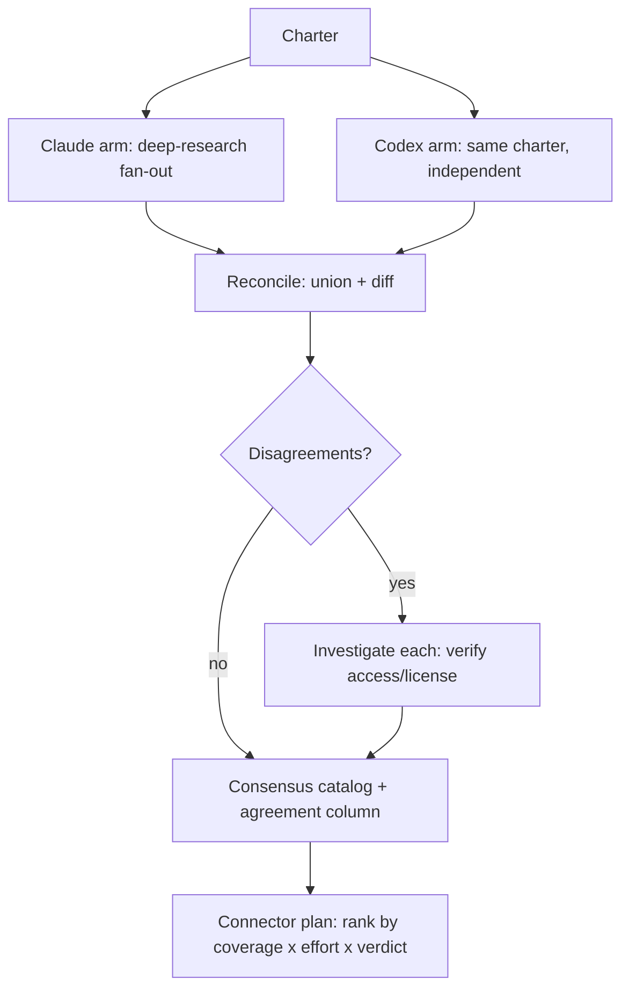

# Open Data Sources for DD / KYC / Market Research — Research Charter

**Date:** 2026-06-21
**Status:** Approved scope — pending charter review
**Owner:** Dmytro Maliarenko
**Deliverable:** Vetted consensus source catalog **+** prioritized connector plan (option 2)

---

## 1. Problem & Goal

The `company-due-diligence` skill has a strong **abstract** source model — `references/source_priority_rules.md` (3 tiers, ~33 `source_class` values) and `references/legal_and_tos.md` (access/retention/sensitivity metadata) — but only **two concrete named sources are wired into code**: SEC EDGAR (`cdd/extract/edgar.py`) and OFAC SDN (`cdd/extract/sanctions.py`). A few more are *named* in prose (EU/UK-OFSI/UN consolidated, BIS Entity List, Companies House, SEDAR, ASX) but not catalogued with access/licensing detail or wired.

**Goal:** produce a **vetted, consensus inventory of concrete, named open / government data sources** for corporate DD, KYC/AML, and market research — each with access method, licensing/redistribution verdict, coverage, and a mapping to our existing `source_class` taxonomy — plus a **ranked connector plan** for wiring the highest-value sources into `cdd/extract/`. No connector code is written under this charter; building is a separate, later cycle.

**Non-goals:** building connectors now; paid/licensed-only data providers (Bloomberg, PitchBook, etc.) beyond noting them as `licensed_subscription`; exhaustive enumeration of every national registry on earth (see Tier C).

---

## 2. Scope

### 2.1 Domains (all three — equally weighted)
- **Corporate DD** — company registries, regulatory filings, beneficial ownership, litigation/court records, financials, patents/trademarks.
- **KYC / AML** — sanctions, export-control & watchlists, PEP lists, UBO/beneficial-ownership registers, adverse-media signals.
- **Market research** — market sizing, industry & trade statistics, economic indicators, government open-data portals.

### 2.2 Geographic model — global, tiered (bounded, not exhaustive)
- **Tier A — global / multi-jurisdiction aggregators** (max coverage per integration). Deep-vet all.
  Seed set (research must confirm/extend): GLEIF LEI, OpenCorporates, OpenSanctions, OFAC (SDN + Consolidated), EU Consolidated sanctions, UN Consolidated, UK OFSI Consolidated, BIS Entity List, OpenOwnership (UBO), World Bank, OECD, IMF, UN Comtrade, USPTO / EPO / WIPO PATENTSCOPE, OpenAlex / Wikidata (signals).
- **Tier B — top national primary sources** by deal-flow / GDP. Deep-vet.
  Seed set: SEC EDGAR (US), UK Companies House, EU BRIS / national business registers, EDINET (JP), SEDAR+ (CA), ASX / SGX / HKEX, India MCA.
- **Tier C — long tail.** Catalogue as **pointers only** (name + URL + one-line access note); no deep vetting.

**Effort cap:** deep-vet **~25–40 sources** (Tiers A+B); pointer-list the remainder. This bound is explicit to prevent unbounded fan-out.

---

## 3. Vetting Schema ("can we actually use it")

Every deep-vetted source is captured with these columns. Field names align with the skill's existing `legal_and_tos.md` / `source_inventory` model so the catalog drops straight into the metadata system.

| Column | Notes |
|---|---|
| `name` | Canonical source name |
| `domain(s)` | Corporate DD / KYC-AML / Market research |
| `geo_coverage` | Global, or jurisdiction list |
| `access_method` | `api` / `bulk_download` / `scrape` / `manual` |
| `auth` | none / free API key / registration / paid key |
| `rate_limits` | Documented limits (e.g. EDGAR 10 req/s) |
| `license` | License name + URL |
| `redistribution` | May we store & redistribute extracted data? (drives `retention_policy`) |
| `retention_policy` | Maps to `indefinite` / `session_only` / `per_license` |
| `cost` | free / freemium / paid |
| `freshness` | Update cadence |
| `source_class` | Mapped to existing taxonomy (new class proposed if none fits) |
| `verdict` | ✅ wire now / ⚠️ conditional / ❌ avoid — with one-line rationale |
| `agreement` | Consensus marker (see §4): both / claude-only / codex-only |

---

## 4. Method — parallel research + consensus

1. **Claude arm** — run the `deep-research` skill fan-out against the scope in §2, capturing the §3 schema. Verify each source's access/license against the primary source page (not memory).
2. **Codex arm** — hand Codex the *same charter* independently via the codex runtime (`codex:rescue`). Codex returns its own list in the §3 schema.
3. **Reconcile** — union both lists. Mark each source `both` / `claude-only` / `codex-only`. For every `claude-only` / `codex-only` source and every conflicting field (license, access method, verdict), **investigate and resolve** — do not silently prefer one arm. Record the resolution basis.
4. **Consensus catalog** — single ranked table; disagreements either resolved or flagged with the open question.
5. **Connector plan** — rank ✅/⚠️ sources by **(coverage × ease-of-integration × verdict)**; output an ordered backlog of connectors for `cdd/extract/` with a one-line integration sketch each (e.g. "GLEIF LEI: REST `/api/v1/lei-records`, JSON, no auth, indefinite retention").

---

## 5. Outputs

1. `company-due-diligence/references/open_data_sources.md` — the consensus catalog (Tiers A+B deep-vetted table + Tier C pointer list), in the §3 schema.
2. **Connector plan** — a ranked backlog section (in the same doc or a short companion), each item sized and mapped to a `source_class`. Feeds a later `writing-plans` cycle if you choose to build.
3. Proposed additions to `references/source_priority_rules.md` (any new `source_class` values surfaced).

---

## 6. Acceptance Criteria

- [ ] 25–40 sources deep-vetted across all three domains and Tiers A+B; Tier C pointer-listed.
- [ ] Every deep-vetted source has every §3 column populated (or explicit `unknown`).
- [ ] Every source carries an `agreement` marker; every disagreement is resolved or flagged.
- [ ] Every `verdict` cites a license/ToS basis — no usability claim without a source.
- [ ] Connector plan ranks ✅/⚠️ sources by coverage × effort × verdict.
- [ ] Catalog field names align with `legal_and_tos.md` so it integrates with the existing metadata model.

---

## 7. Risks / Open Questions

- **License drift** — ToS change; catalog records an `as-of` date per source.
- **Aggregator vs. primary** — aggregators (OpenCorporates, OpenSanctions) ease integration but add a redistribution-terms layer over the underlying primary data; flag where the aggregator's license is stricter than the primary.
- **Codex availability** — if the codex runtime is unavailable headless, fall back to a second independent Claude research pass with a different search strategy, and note the substitution.
